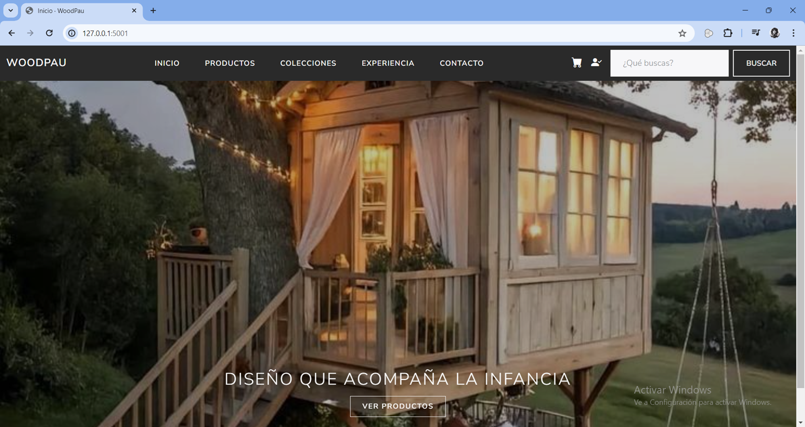
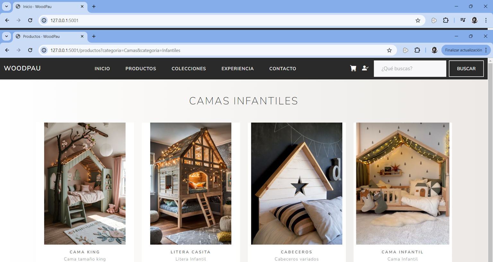
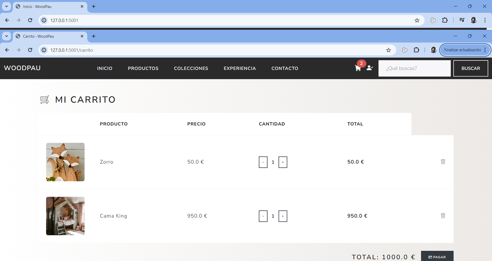
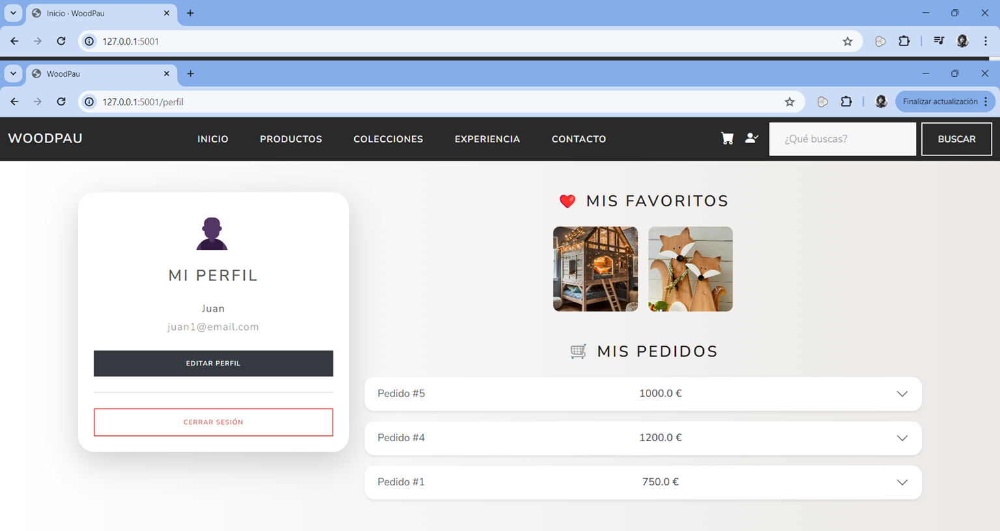
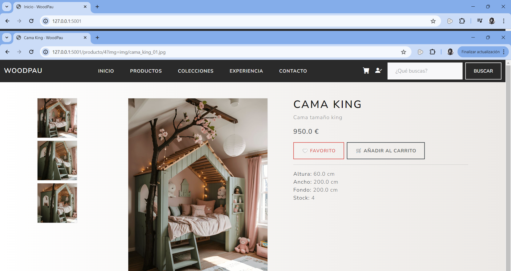
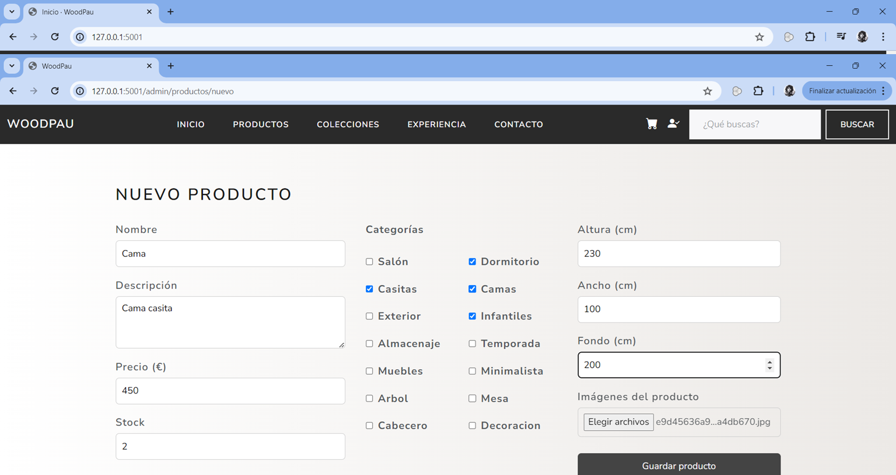
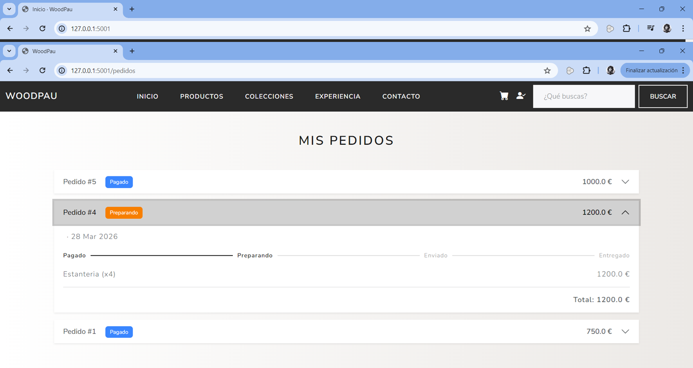
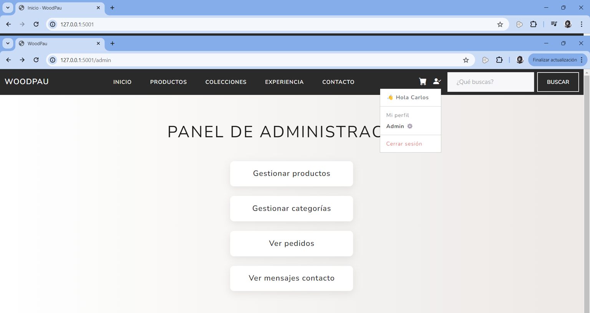

# 🚀 E-commerce Python App

## 🧾 Descripción

Proyecto que simula una tienda online real, permitiendo a los usuarios:

- Navegar por un catálogo de productos  
- Gestionar un carrito de compra  
- Realizar pedidos  

Incluye tanto la parte de cliente como un **panel de administración completo** para la gestión interna del sistema.

---

## ⚙️ Tecnologías

- **Backend:** Python, Flask  
- **Base de datos / ORM:** SQLAlchemy + SQLite  
- **Frontend:** HTML, CSS, Bootstrap, JavaScript  
- **Arquitectura:** MVC  

---

## 🔧 Funcionalidades

### 👤 Usuario

- Registro e inicio de sesión  
- Catálogo y búsqueda de productos  
- Carrito de compra  
- Gestión de direcciones  
- Realización de pedidos  
- Historial de pedidos  
- Sistema de favoritos  

### 🛠️ Administrador

- Panel de administración  
- Gestión de productos y categorías  
- Gestión de pedidos (estados)  
- Gestión de mensajes de contacto  

---

## 🧠 Arquitectura

Aplicación estructurada siguiendo el patrón **MVC (Modelo-Vista-Controlador)**, separando:

- Lógica de negocio  
- Acceso a datos  
- Presentación  

Esto facilita el mantenimiento y la escalabilidad del proyecto.

---

## ▶️ Ejecución

```bash
git clone https://github.com/cviejo-python/ecommerce-python-app.git
cd ecommerce-python-app

python -m venv venv
venv\Scripts\activate   # En Windows

pip install -r requirements.txt
python main.py
🎯 Objetivo

## 📸 Aqui muestro algunos de los pantallazos del proyecto

### 🏠 Portada


### 🧩 Colecciones


### 🛒 Carrito de compra


### 👤 Perfil


### 📦 Producto


### ➕ Nuevo producto


### 📋 Pedido


### ⚙️ Panel de administración


Simular un entorno real de desarrollo backend, aplicando buenas prácticas con Python y construyendo una aplicación completa de tipo e-commerce.

## 📄 Documentación

📘 [Memoria del proyecto](documentacion/Memoria_Proyecto_WOODPAU.docx)

📫 Contacto
📧 cviejo10@gmail.com
💻 https://github.com/cviejo-python
